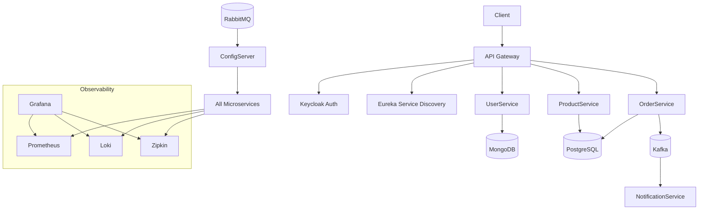

# 🛒 eCommerce Microservices Platform

Production-like microservices-based eCommerce platform built with Spring Boot and Java, designed following modern distributed system principles.

The system implements a distributed architecture including API Gateway, service discovery, centralized configuration, event-driven communication, resilience patterns, security, and a full observability stack. The infrastructure is containerized using Docker, while microservices containerization is currently in progress. The system is designed to be cloud-ready.

---

## 🏗️ Architecture & Key Features

This project follows a microservices architecture where each service is independently deployable, loosely coupled, and owns its data.

### Core architecture components

- **API Gateway**: Central entry point for routing, filtering, and security
- **Service Discovery**: Dynamic service registration and lookup using Eureka
- **Centralized Configuration**: Externalized configuration managed via Spring Cloud Config
- **Event-Driven Communication**: Asynchronous messaging using Apache Kafka
- **Dynamic Configuration Updates**: Spring Cloud Bus powered by RabbitMQ
- **Database per Service**: PostgreSQL and MongoDB ensuring loose coupling
- **Security**: OAuth2 authentication via Keycloak (PKCE flow)
- **Resilience**: Fault tolerance using Resilience4j (circuit breaker, rate limiter)
- **Observability**: Metrics, logs, and tracing using Grafana, Prometheus, Loki, and Zipkin
- **Containerization**: Infrastructure services containerized with Docker; microservices containerization in progress

### System characteristics

- Microservices-based architecture with clear bounded contexts
- Combination of synchronous (REST) and asynchronous (event-driven) communication
- High cohesion within services and low coupling between them
- Designed for scalability and cloud deployment
- Infrastructure reproducible via Docker Compose

---

## 🔄 System Flow

1. Client requests enter through the API Gateway
2. Gateway validates authentication via Keycloak (OAuth2 with PKCE)
3. Requests are routed dynamically using service discovery (Eureka)
4. Microservices communicate:
  - Synchronously via REST
  - Asynchronously via Kafka events
5. Order events trigger the Notification service
6. Configuration changes are propagated using Spring Cloud Bus (RabbitMQ)
7. Logs, metrics, and traces are collected and visualized through the observability stack

---

## 🧠 Design Decisions

- **Kafka** is used for asynchronous communication to decouple services and improve scalability
- **RabbitMQ** is used for configuration updates via Spring Cloud Bus
- **Keycloak** provides centralized authentication and authorization using OAuth2
- **Resilience4j** ensures system stability and fault tolerance under load
- **Database per service** pattern ensures loose coupling and independent scalability

---

## ☁️ Cloud Readiness

The system is designed to be deployed in cloud environments such as AWS:

- Containerized infrastructure and evolving toward fully containerized services
- Stateless services enabling horizontal scaling
- Externalized configuration for environment flexibility
- Scalable messaging infrastructure
- Clear separation between infrastructure and application layers

---

## 🐳 Installation & Execution

### 📋 Prerequisites
- Docker & Docker Compose
- Java 26
- Maven 3.x

## 🐳 Installation and Execution with Docker

### 1. Clone the repository:

```bash
git clone https://github.com/leoga/ecom-microservices-application
cd ecom-microservices-application
```

### 2. Start services with Docker Compose, in root and Grafana directory:
```bash
docker-compose up -d
```

🔧 Infrastructure Services from root directory:
- **PostgreSQL** on port `5432`
- **MongoDB** on port `27017`
- **pgAdmin** on port `5050`
- ~~**RabbitMQ** on port `5672`~~ RabbitMQ moved to cloud configuration using [CloudAMQP](https://www.cloudamqp.com/)
- **Redis** on port `6379` (For Rate Limiter implementation at Gateway level)
- **Kafka** on port `9092`
- **Keycloak** on port `8443`

📊 Observability Stack from Grafana directory:
- **Grafana** on port `3000` (http://localhost:3000)
- **Loki's related services**
- **Prometheus** on port `9090` (http://localhost:9090)
- **Zipkin** on port `9411` (http://localhost:9411)

All services are preconfigured as Grafana data sources for centralized monitoring.


### 3. Build and run the services, first the ConfigServer and Eureka services, and later the user, product, notification and order services:
```bash
./mvnw clean package
./mvnw spring-boot:run
```

## 🔐 Security

Authentication and authorization are handled using Keycloak:

- OAuth2 protocol
- PKCE flow
- Centralized authentication at API Gateway level

A Keycloak realm backup is included in the repository.

## 🔧 Configuration

### Database
The application connects to PostgreSQL with the following configuration (defined in `application.yml`):

- **URL**: `jdbc:postgresql://localhost:5432/leoga`
- **Username**: `leoga`
- **Password**: `leoga`

### pgAdmin
Access pgAdmin at `http://localhost:5050`:
- **Email**: `pgadmin4@pgadmin.org`
- **Password**: `admin`

### MongoDB (Install Compass)
- **URL**: mongodb://localhost:27017/userdb

### Keycloak
After importing the realm backup, you need to create a user with the admin role. This user will be required to configure the user service. 

- **URL**: `http://localhost:8443`
- **Username**: `admin`
- **Password**: `admin`

## 📚 API Documentation

For more details about available endpoints, see [API_DOCUMENTATION.md](API_DOCUMENTATION.md)

## 🧩 Architecture Diagram

This is a **microservices** application with the following structure:



## 🛠️ Technologies

- **Framework**: Spring Boot 4.0.5 and Spring Cloud 2025.1.1
- **Language**: Java 26
- **Database**: PostgreSQL 18 and MongoDB 8.2.5 Community 
- **ORM**: Hibernate/JPA
- **Build Tool**: Maven
- **Containerization**: Docker & Docker Compose
- **Additional Dependencies**:
  - Lombok
  - Spring Data JPA
  - MapStruct

## 📌 Notes

This project was initially inspired by a training course and later extended with additional features and architectural improvements to resemble a production-like distributed system.

## 👤 Author

Leoga


