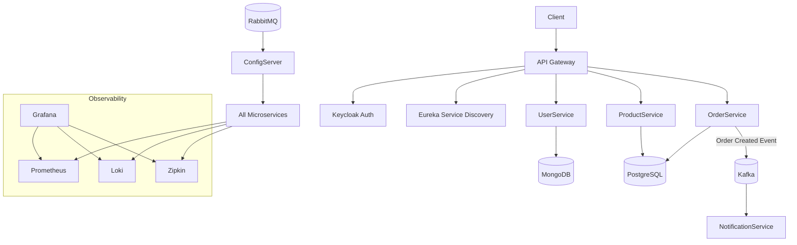

# 🛒 eCommerce Microservices Platform

Production-like microservices-based eCommerce platform built with Spring Boot and Java, designed following modern distributed system principles.

The system implements a distributed architecture including API Gateway, service discovery, centralized configuration, event-driven communication, resilience patterns, security, and a full observability stack. The infrastructure is fully containerized using Docker, including the observability stack and deployment configuration.

## ⚡ Quick Start

Make sure Docker is running, then:
```
git clone https://github.com/leoga/ecom-microservices-application
cd ecom-microservices-application/deploy/docker
docker compose up -d
```

> ℹ️ RabbitMQ is configured using [CloudAMQP](https://www.cloudamqp.com/). Connection details are loaded from environment variables (.env files).
> If you prefer, you can replace this with a local RabbitMQ instance by updating the configuration.

## 🏗️ Architecture & Key Features

This project follows a microservices architecture where each service is independently deployable, loosely coupled, and owns its data.

### Core architecture components

- **API Gateway**: Central entry point for routing, filtering, and security
- **Service Discovery**: Dynamic service registration and lookup using Eureka
- **Centralized Configuration**: Externalized configuration managed via Spring Cloud Config (configuration loaded from an external configuration [repository](https://github.com/leoga/app-configuration/tree/main/ecom-microservices))
- **Event-Driven Communication**: Asynchronous messaging using Apache Kafka
- **Dynamic Configuration Updates**: Spring Cloud Bus powered by RabbitMQ
- **Database per Service**: PostgreSQL and MongoDB ensuring loose coupling
- **Security**: OAuth2 authentication via Keycloak (PKCE flow)
- **Resilience**: Fault tolerance using Resilience4j (circuit breaker, rate limiter, retry)
- **Observability**:
  - Metrics via Prometheus
  - Centralized logging with Loki + Alloy
  - Distributed tracing via Zipkin
  - Visualization through Grafana dashboards
- **Containerization**: Full Docker-based deployment

## 📦 Deployment Structure

All Docker-related configuration has been consolidated into:

```
ecom-microservices/deploy/docker
```

### Key files

- docker-compose.yml → Full platform (infrastructure + app services)
- docker-compose-without-app-services.yml → Infrastructure only (run services locally)

📌 Run all Docker commands from this directory.

## 🐳 Containerization Strategies

The platform supports three different ways to build and run microservices containers.

👉 The default and recommended approach in this project is **Google Jib**.

### 1️⃣ Dockerfiles (classic approach)

Provides full control over the image. After building the projects, execute:

```
docker compose build
```
Or this command to build and run the images all at once:
```
docker compose up --build -d
```

Inside docker-compose.yml file choose this option in every microservice:
```
build: ../../configserver
```

---

### 2️⃣ Spring Boot Buildpacks

Generates OCI images without a Dockerfile.

Inside docker-compose.yml file choose this option in every microservice:
```
image: ecom/config-server
```

This must match the name provided in the pom.xml file of every project.

Notes:
- Uses Paketo Buildpacks
- No Dockerfile required
- Requires additional configuration for health checks:

```
THC_PATH=/actuator/health
THC_PORT=8889
```

---

### 3️⃣ Google Jib (recommended)

Optimized for fast builds and CI/CD pipelines.
Inside docker-compose.yml file choose this option in every microservice:
```
image: leogatf/config-server
```

This follows this structure:
```
image: <docker-hub-user>/<image-name>
```

This must match the name provided in the pom.xml file of every project.

Notes:

- `jib:build` pushes images directly to a registry without requiring a Docker daemon
- `jib:dockerBuild` builds the image locally and requires Docker to be running


#### Push to Docker Hub

```
./mvnw clean compile jib:build
```

Requirements:
- You must be authenticated:
```
docker login
```

---

#### Build directly into local Docker

```
./mvnw clean compile jib:dockerBuild
```

Requirements:
- Docker Desktop must be running

---

### 📊 Comparison

| Approach   | Pros                          | Cons             | Use case        |
| ---------- | ----------------------------- | ---------------- | --------------- |
| Dockerfile | Full control                  | More maintenance | Custom builds   |
| Buildpacks | No Dockerfile, simple         | Less flexible    | Quick setup     |
| Jib        | Fast, no Docker daemon needed | Requires config  | CI/CD pipelines |

## ⚙️ Build Automation

Scripts are provided to automate builds:

- build-projects.sh
- build-projects-buildpack.sh
- build-projects-jib-build.sh
- build-projects-jib-docker-build.sh

Important:
- These scripts require a Unix-like environment
- Use Git Bash on Windows or any Linux/macOS terminal

## 🚀 Running the Platform

💡 Make sure you are inside `deploy/docker` before running these commands.

### Full platform (containers + services)

```
docker compose up -d
```

---

### Infrastructure only (run services locally)

```
docker compose -f docker-compose-without-app-services.yml up -d
```

This starts:
- Databases
- Kafka
- Keycloak
- Observability stack

But NOT the microservices, allowing you to run them from your IDE.

## 📊 Observability Stack

Integrated into Docker Compose:

- Grafana → http://localhost:3000
- Prometheus → http://localhost:9090
- Zipkin → http://localhost:9411
- Loki + Alloy → centralized logging

All services are preconfigured as Grafana data sources.

## 🔄 System Flow

1. Client → API Gateway
2. Gateway → Keycloak (OAuth2 + PKCE)
3. Gateway → Eureka (service discovery)
4. Microservices communication:
   - REST (synchronous)
   - Kafka (asynchronous)
5. Order events → Notification service
6. Config updates → RabbitMQ (Spring Cloud Bus)
7. Observability stack collects logs, metrics, and traces

## 🔐 Security

- OAuth2 authentication via Keycloak
- PKCE flow
- Centralized authentication at API Gateway
- Token propagation handled at Gateway level

A Keycloak realm backup is included.

## 🔧 Configuration

### PostgreSQL
```
jdbc:postgresql://localhost:5432/leoga
```

### pgAdmin

Register a new server with:

- Host: `postgres`
- Username: `leoga`
- Password: `leoga`

Access from:

- http://localhost:5050
- password: admin (password of your choice in the first access)

### MongoDB
```
mongodb://localhost:27017/userdb
```

### Keycloak

After importing the realm backup, create a user with the admin role. This user is required to configure the user service.

- http://localhost:8443
- user: admin
- password: admin

## 📚 API Documentation

For more details about available endpoints, see [API_DOCUMENTATION.md](API_DOCUMENTATION.md)

## 🧩 Architecture Diagram



## 🛠️ Technologies

- Spring Boot 4.0.5
- Spring Cloud 2025.1.1
- Java 26
- PostgreSQL 18
- MongoDB Community
- Kafka
- Docker & Docker Compose
- Jib & Buildpacks
- Maven
- Additional dependencies:
  - Lombok
  - MapStruct
  - Spring Data JPA (Hibernate/JPA)

## 💡 Why this project

This project was initially inspired by a training course and later evolved into a platform that demonstrates how to design and implement a production-like microservices architecture, incorporating real-world features and architectural improvements, including:

- Distributed system patterns
- Observability (metrics, logs, tracing)
- Multiple containerization strategies (Dockerfile, Buildpacks, Jib)
- Secure API exposure using OAuth2 and PKCE
- Event-driven communication with Kafka
- Build scripts included for automation

It is intended as a portfolio project to showcase real-world backend architecture skills.

## 👤 Author

Leoga